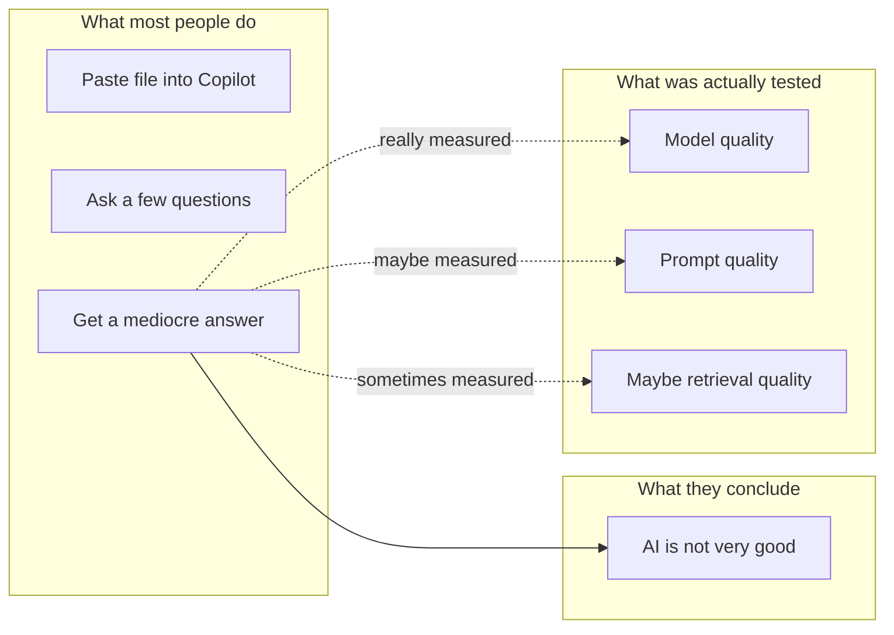
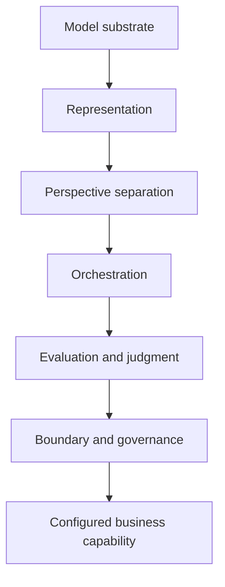
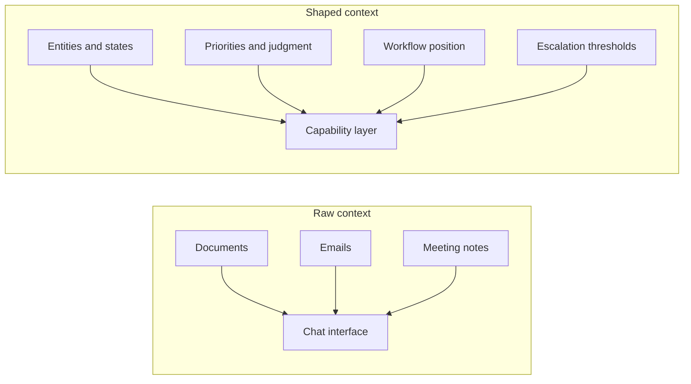

<header class="model-product-hero">
  
Essay Draft • Means of Production

  <h1>The Model Is Not the Product</h1>
  
Why a mediocre result from Copilot or ChatGPT usually says less about AI than about the mental model behind how it is being used.

</header>

One of the LightForge team told me this week about a request they had heard from a prospect: connect my Google Drive, my email, my meeting notes, and build a virtual me.

That is one version of the misunderstanding.

The other version is quieter and, in some ways, more important. It sounds like this:

> I copied the document into Copilot, asked a few questions, and the result wasn't very good.

I think that is a fair reaction. In fact, it may be the most honest and sensible reaction available if the only thing you have really tried is dropping a file into a chatbot and hoping the system will somehow bridge the gap between "what is in this document?" and "what should happen in my business?"

There are plenty of cases where a thin chat interaction is genuinely useful. A summary, a reframing, a first draft, a decent comparison, an extraction pass, sure. I use those all the time. But I also think a lot of smart people are running a very narrow test, getting a middling result, and then drawing a much broader conclusion than the test really supports.

A friend of mine recently described using Grok to do things like look up the sizing of a certain faucet, check whether it fit a building code requirement, and then see whether that code had been updated. That is real value. In fact, it is pretty great value. It is something like advanced retrieval plus synthesis plus recency checking. In many cases it is better than old-school Google because it collapses a bunch of manual searching and cross-checking into one pass.

But I think that example helps because it is useful without being magical. Grok, in that case, is acting like a very strong research assistant or code-checking clerk. It is not really acting like an operator embedded in a business workflow. It is not carrying a bounded job across state, judgment, handoffs, and accountability. It is helping answer a question very well.

That distinction matters because I think there are at least three different layers of AI value floating around in people's heads and getting blurred together. There is AI as advanced retrieval and synthesis, which is the Grok/faucet/building-code case. There is AI as a workbench assistant, which is the Copilot/ChatGPT "help me summarize this, draft this, or think through this" case. And then there is AI as configured capability, where the system is no longer just helping with an answer but is actually helping a bounded piece of work move correctly through a real workflow. I am not dismissing the first two. I use them constantly. I just think the third is a different thing, and it is the thing most worth understanding if you are trying to build or buy something durable.

The mental model gap, as I see it, is this: most people are treating the model as though it is already the finished product. I do not think it is. I think the model is much closer to raw cognitive horsepower. Useful, yes. Impressive, yes. Sometimes almost unsettlingly good. But not, by itself, the thing a business is actually buying.

That distinction matters a lot.

## The test most people are actually running

If you take a document, drop it into Copilot or ChatGPT, and ask a few good questions, you are running a pretty specific test. You are asking whether a general-purpose reasoning engine, with a thin interface around it, can produce a useful answer in a single interaction. Sometimes it can. Sometimes it really can. But that is not the same thing as asking whether AI can support a real business capability.

Those are different questions, and they fail in different ways.

If what you wanted was "give me a summary of this" or "help me think through this memo" or "find the obvious gaps," a thin interaction layer may be enough. But if what you really wanted was something more like "tell me what matters here for my business," "identify the real risk and not just the visible one," "understand what step this sits inside," or "handle this the way a strong operator on my team would handle it," then you have already moved into a different category of problem. That is no longer just a question-answering exercise. That is capability design, whether you call it that or not.

I should note that this is one reason the current conversation around AI can feel slippery. People think they are evaluating the whole stack when they are often just evaluating a very thin slice of it.

## The model is the engine, not the vehicle

The easiest analogy I have found for this is still a mechanical one.

If you hand someone a powerful engine, they do not yet have a delivery van, or a forklift, or a race car, or a tractor. They have a powerful component that can become one of those things if it is put into the right frame, connected to the right controls, and aimed at a specific job. The engine matters. It matters a lot. But no one confuses the engine with the finished vehicle unless they are being careless, or unless the technology is new enough that people are still dazzled by raw power.

I think frontier AI models are in that phase.

The model is the engine.

The finished business capability is the vehicle.

And I think a lot of present-day AI disappointment comes from confusing those two things. When someone says, "I tried Copilot and it wasn't very good," what I often hear is: "I put a powerful engine on the floor, sat on it, and it did not drive like a truck." That does not mean the engine is useless. It means there is more between raw power and useful work than people first assume.

Tech note: I am not claiming foundation models do not matter

The narrower claim is that the durable product layer usually sits above raw model access. Model quality matters. Retrieval quality matters. Tool access matters. But if you are trying to create a repeatable business capability, the differentiated work tends to show up in representation, orchestration, evaluation, and boundary design.

## A capability is a different kind of thing

This is the core distinction I have been trying to sharpen for myself.

A model can generate text, summarize, classify, extract, answer, code, and generally behave in ways that look quite intelligent. Those are useful functions. But a business capability is something else. A business capability is a bounded, repeatable ability to get some important piece of work done.

That is why I think it helps to be much more precise about the unit of value.

"Retrieve the email" is a function. "Pull fields from the attachment" is a function. "Draft the reply" is a function. "Correctly handle inbound RFP requests and move them to the next step" is a capability.

Businesses do not really buy AI for its own sake. They buy improvements in how work gets done. They buy fewer dropped balls, fewer manual handoffs, fewer missed details, faster throughput, lower cost, lower friction, better decisions in workflows that actually matter. In other words, they buy a capability that changes the economics of a piece of work.

That is why I keep coming back to the same phrase: the model is not the product. The configured capability is the product.

Tech note: what I mean by "configured capability"

Not just a prompt and not just a wrapper. Usually some combination of workflow state, shaped context, tool access, evaluation logic, escalation thresholds, and persistent definitions of what the system is supposed to do and what it is not supposed to do.

## Why the average chatbot interaction disappoints

I do not think the problem is mainly that the model is dumb. The problem is that a lot of the things people really want from AI are sitting one or two layers above what a basic chat interaction is designed to do.

The first missing layer is definition of what "good" actually means. A chatbot can often tell you what is in a document. It can sometimes tell you what seems important in a general sense. But that is not the same thing as knowing what matters in your organization, in this workflow, right now. Which customer is politically sensitive? Which delay is noise and which one is dangerous? Which recommendation sounds good in theory but would create chaos in practice? That kind of judgment is often not written down anywhere. It lives in people, habits, consequences, and memory.

The second missing layer is workflow. A chatbot gives you an answer. A capability has to fit into a real process. It has to know what starts the work, what comes next, who owns the next step, what system needs to be updated, what counts as done, and when to stop and ask for help. If you do not define those things, then even a smart answer may simply become one more output a human has to interpret and manually route.

The third missing layer is the ability to ignore the wrong things. This matters more than many people think. A lot of business judgment is not just about seeing what is present; it is about knowing what does not matter yet. If three vendors say an order may be delayed, should the system trigger a full remediation workflow? Maybe. Or maybe the right move is to flag it, wait a day, and see whether the signal hardens into something real. A thin chat interaction usually does not know that difference, because why would it?

The fourth missing layer is shaped context. People often say, "well, I gave it the file." Sure. But a file is not the same thing as usable operating context. Useful context is usually shaped. It has the right facts in the right structure with the right relationships attached to the right decisions inside the right boundary. That is different from "we uploaded a bunch of stuff."

And the fifth missing layer is repeatability. A good answer is nice. A repeatable business ability is better. A real capability has to work more than once, stay inside scope, fit into a workflow, expose mistakes, and operate with some consistency over time. That is a much higher bar than "this answer felt impressive."

Tech note: retrieval is not the same thing as representation

Getting the right chunk back from a vector store is useful. It is not the same thing as having a stable internal representation of entities, states, relationships, priorities, and workflow position. A lot of systems blur those together and then wonder why the outputs feel intelligent but operationally slippery.

## So what does a real capability require?

Once I started thinking about AI this way, the architecture started to matter a lot more than the interface.

At a very practical level, I think a real AI capability usually requires six things. It needs a bounded job. It needs a reasonably clear definition of what good looks like. It needs the right structure underneath the work so it is not improvising its own schema as it goes. It needs some orchestration, because not every meaningful problem should be solved in one shot. It needs human judgment in the places where human judgment actually matters. And it needs boundaries, because a capability without edges tends to become a blob.

That last one is especially important. A useful capability should be able to answer both of these questions: what do I do, and what do I not do? If you skip the second question, the system tends to sprawl in exactly the way software usually sprawls: costs go up, expectations get fuzzy, and reliability starts to bend under the weight of ambiguity.

This is also why "make an AI version of me" is harder than it sounds. The naive version of that idea is: connect my inbox, connect my docs, connect my meetings, and now the system knows me. But that is not usually where the real expertise lives. Real expertise often includes what the person notices quickly, what they routinely discount, what they worry about before others do, what they treat as noise, what they escalate immediately, and what tradeoffs they make under pressure. That is not simply a document problem. It is partly a cognition problem and partly a workflow problem, which means that if you want the system to reproduce some bounded slice of expert behavior, you usually need to design for it deliberately. You are not just giving it more content. You are shaping a capability.

## Said a bit more technically

For the technical crowd, the claim here is not "chatbots are bad" or "foundation models do not matter." They obviously do matter. And a lot of valuable software will continue to look like a well-built model interface with retrieval, tools, and a good workflow around it.

The claim is narrower than that, and, I think, more useful: the differentiated product layer is usually above the model.

More concretely, if you are trying to build something durable for business use, the hard work tends to sit in a handful of layers that are easy to underweight when everyone is fixated on the model itself.

The first is **representation**. What is the internal shape of the problem? What are the entities, the states, the relationships, the memory shape? If the representation is bad, the system will still produce plausible output for a while, but it will tend to drift, shortcut, or stuff new information into the wrong place. This is one reason purely top-down prompting often disappoints in more complex systems. The model can describe a good answer before it has a stable internal structure for producing one.

The second is **perspective separation**. Some tasks really do require distinct viewpoints. If you compress interpretation, generation, critique, and decision into one giant context window, you often get what I think of as perspective collapse. The output may sound smooth, but the actual tensions between roles disappear. That is why staged passes, role separation, or multi-agent patterns can matter. Not because "more agents" is fashionable, but because some work benefits from preserving distinct ways of seeing the problem.

The third is **orchestration**. What runs in what order? What gets reviewed? What loops back? What escalates? A lot of AI failure is really orchestration failure. The right step happened too early. Critique came too late. State was not refreshed. The system acted when it should have paused. This is where capability starts becoming operational rather than merely clever.

The fourth is **evaluation and judgment**. Retrieval is useful. RAG is useful. Tool access is useful. None of those, by themselves, tell the system what counts as a good decision in your environment. That usually requires explicit criteria, business priorities, exception logic, review thresholds, and some mechanism for judging outputs against real expectations.

And the fifth is **boundary and governance**. Capabilities need edges. What is in scope? What is out of scope? When can the system act? When must it escalate? What happens when it is wrong? This is the less glamorous part of the work, but it is also a major part of what turns an interesting AI demo into something a business can actually trust.

Tech note: the thin-layer failure modes I expect most

Perspective collapse inside one giant context window. Local plausibility beating system coherence. Retrieval without shaped context. No explicit evaluation pass. No stable workflow state. No real boundary between draft, recommend, and act.

## Three pictures that help

At some point diagrams are more honest than more prose, so here are the three pictures I think help most.

### Picture one: what most people test versus what they think they tested

a thin interaction layer often gets mistaken for the whole stack

### Picture two: model versus capability stack

the model matters, but the durable product layer usually sits above it

### Picture three: raw context versus shaped context

more information is not the same thing as better operational context

## The questions I would ask instead

If I were evaluating an AI product or vendor for business use, I do not think I would start with which model are you using, can it read our documents, or can it sound like our team. Those are not irrelevant questions, but they are secondary.

I would want to know what specific capability is being improved, where it fits in the workflow, how the system knows what good looks like, what it explicitly does not do, and what happens when it is wrong. Those questions get you much closer to whether you are buying something real.

That, to me, is the more interesting shift now underway in the market. A lot of current AI tooling is still sold at the level of interface and impression: chat with your data, ask better questions, generate insights, automate work. Some of that is useful. Some of it is real. But it is also easy to stop one layer too early and mistake a clever demo for a durable business instrument.

I think the more interesting companies over the next few years will be the ones that move one layer up, from model access to capability design. That is where things start becoming economically meaningful. It is also where disappointment tends to go down, because you are no longer asking the system to magically become useful. You are defining the job, the boundary, the context, the review, and the measure of success.

In other words, you are shaping the vehicle, not just admiring the engine.

<strong>I should note:</strong> none of this means the first Copilot or ChatGPT test was stupid. It was a perfectly reasonable first experiment. I just think a lot of people are drawing a much broader conclusion from a much narrower test than they realize.

## So what is the takeaway?

If you pasted a document into Copilot, asked a few questions, and the result was not very good, that does not necessarily mean AI is weak. It may just mean you tested the wrong layer.

You tested whether a raw reasoning engine could give you a useful answer in a single interaction. That is a perfectly reasonable first test. But it is not the same thing as testing whether AI can support or improve a real business capability.

And once you see that distinction, I think the conversation gets a lot more honest. You stop asking which model should we use and start asking what capability are we trying to improve, what does good actually look like, what context does the system really need, where does human judgment belong, and how do we make this repeatable.

That feels like a much better conversation to me.

