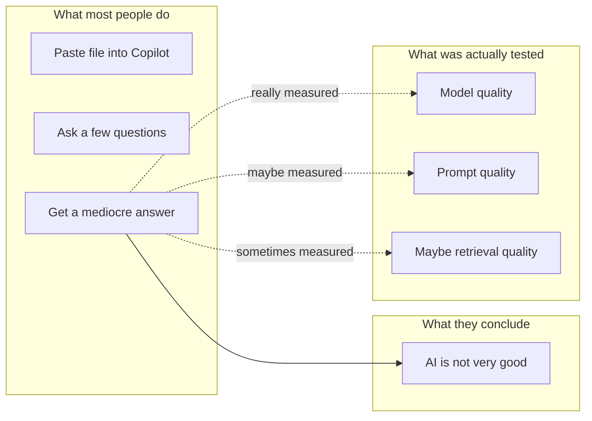
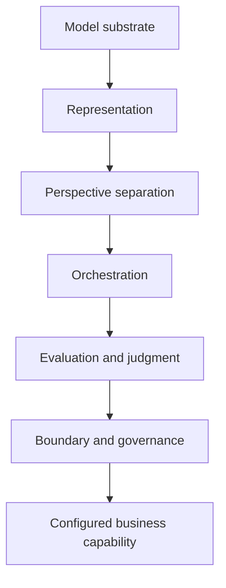
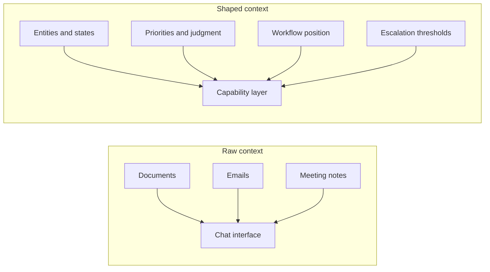

<header class="model-product-hero">
  
Essay Draft • Means of Production

  <h1>The Model Is Not the Product</h1>
  
Why a mediocre result from Copilot or ChatGPT usually says less about AI than about the mental model behind how it is being used.

</header>

This week one of the LightForge team described a request they had heard that I think captures a pretty common misunderstanding about AI: connect my Google Drive, my email, my meeting notes, and build a virtual me.

At the same time, I keep running into a separate but related reaction from smart, sophisticated, and very much not naive business people:

> "I copied the document into Copilot, asked a few questions, and the result wasn't very good."

I think that is a fair reaction.

In fact, I think a lot of sensible people are having some version of that experience:

- they paste a document into ChatGPT or Copilot
- they ask for a summary, an analysis, or a recommendation
- the result is sort of fine, but not especially useful
- and they conclude that the whole AI thing is being oversold

Sometimes it is being oversold. But I also think there is a different problem: people are often using AI in a way that almost guarantees disappointment, and then taking that disappointment as proof that the underlying capability is weak.

The mental model gap, as I see it, is this:

most people are treating the model as though it is already the finished product.

I don't think it is.

I think the model is much closer to raw cognitive horsepower. Useful, yes. Impressive, yes. Sometimes shockingly so. But not, by itself, the thing a business is actually buying.

That distinction matters a lot.

## Why the Copilot experience often disappoints

If you take a document, drop it into a chatbot, and ask a few good questions, the system may absolutely help you.

It may:

- summarize the document
- extract themes
- draft a follow-up email
- identify obvious gaps
- propose a next step

That is real value.

But if what you actually wanted was something more like:

- tell me what matters here for my business
- identify the real risk, not just the obvious one
- understand what this means in the context of our workflow
- decide what should happen next
- handle this the way a strong operator on my team would handle it

then a one-off chat interaction is usually the wrong instrument.

Not because the model is bad.

Because you are asking a general-purpose reasoning engine to behave like a finished business capability.

That is a different thing.

## The easiest way I know to explain this

I keep coming back to a pretty simple analogy.

If you hand someone a high-performance engine, they do not yet have a delivery van, or a forklift, or a race car, or a tractor. They have a powerful component that can become one of those things if it is put into the right frame, connected to the right controls, and aimed at a specific job.

I think frontier AI models are like that.

The model is the engine.

The finished capability is the vehicle.

And I think a lot of current AI disappointment comes from confusing those two things.

When someone says, "I tried Copilot and it wasn't very good," what I often hear is:

"I put a powerful engine on the floor, sat on it, and it did not drive like a truck."

That does not mean the engine is useless. It means there is more between raw power and useful work than people first assume.

Tech note: the claim is not "foundation models are commodities, full stop."

The narrower claim is that the durable product layer usually sits above raw model access. Model quality still matters. Retrieval quality matters. Tool access matters. But if you are trying to create a repeatable business capability, the differentiated work tends to be in representation, orchestration, evaluation, and boundary design.

## A model is not the same thing as a capability

This is the core distinction I have been trying to sharpen.

A model can:

- generate text
- answer questions
- classify information
- summarize documents
- draft code
- extract data

Those are useful functions.

But a business capability is different. A business capability is a repeatable, bounded ability to get some important job done.

For example:

- retrieve the email is a function
- pull fields from the attachment is a function
- draft a reply is a function
- correctly handle inbound RFP requests and move them to the next step is a capability

That is a much better unit of thinking.

The reason is simple: businesses do not really buy AI for its own sake. They buy improvements in how work gets done.

They want:

- fewer dropped balls
- fewer manual handoffs
- less retyping and copying
- fewer missed details
- better speed
- lower cost
- better decisions in important workflows

In other words, they want a capability that changes the economics of a piece of work.

That is why I think the model is not the product.

The configured capability is the product.

Tech note: what I mean by "configured capability"

Not just a prompt. Not just a wrapper. Usually some combination of workflow state, shaped context, tool access, evaluation logic, escalation rules, and persistent definitions of what the system is allowed to do. You can implement that in a lot of ways. The implementation detail matters less than the fact that it exists.

## So what is missing from the average chatbot interaction?

Usually, five things.

### 1. It does not know what "good" means in your context

This is one of the biggest issues.

A smart chatbot can tell you what is in the document. It can tell you what seems important in a general sense. It can sometimes even tell you what a thoughtful outside observer might conclude.

But that is not the same thing as knowing what matters in your organization.

Those are often different questions.

For example:

- which customer is politically sensitive right now?
- which type of delay is normal noise and which one is dangerous?
- which exception do we tolerate and which one do we escalate immediately?
- which recommendation sounds good in theory but would create chaos in practice?

That kind of judgment often lives in people, not in documents.

### 2. It does not know the workflow it is supposed to fit into

This is another major gap.

A chatbot gives you an answer. A business capability has to live inside a workflow.

That means it has to know things like:

- what starts the work
- what step comes next
- who owns the next step
- what system it has to update
- what counts as done
- when to stop and ask for help

If you do not define those things, then even a smart answer may not be useful in practice.

You just have one more output for a human to interpret and manually route.

### 3. It does not know what to ignore

This one is underrated.

A lot of business judgment is not just about seeing what is there. It is about knowing what does not matter, yet.

That is a different skill.

If three vendors say an order may be delayed, should the system trigger a full remediation workflow? Maybe. Or maybe not. Maybe the correct move is simply to flag it for follow-up tomorrow and wait for confirmation. A generic chat interaction usually does not know the difference.

Why would it?

### 4. It is usually missing shaped context, not just raw context

People often say, "well, I gave it the file."

Sure. But a file is not the same thing as usable operating context.

Useful context is often shaped. It includes:

- the right facts
- in the right structure
- with the right relationships
- tied to the right decisions
- inside the right boundary

That is different from "we uploaded a bunch of stuff."

I should note: this is one reason I think a lot of AI conversations get confused. People use the word context as though it means "more information." In practice it often means "the right information, shaped for the right job."

Tech note: retrieval is not the same thing as representation

Getting the right chunk back from a vector store is useful. It is not the same thing as having a stable internal representation of entities, states, relationships, priorities, and workflow position. A lot of systems blur those together and then wonder why the outputs feel intelligent but operationally slippery.

### 5. It gives you an answer, not a repeatable business ability

This may be the most important point.

A good answer is nice.

A repeatable business capability is better.

That means the system can:

- do the task repeatedly
- stay inside the intended scope
- fit into a real workflow
- expose mistakes
- improve over time
- operate with some consistency

That is not what most people are testing when they try AI. They are testing whether a single conversation feels impressive.

That is a much lower bar, and also a different one.

## What I think a real AI capability actually requires

Once I started thinking about AI this way, the architecture started to matter a lot more than the chat interface.

At a high level, I think a real AI capability needs at least these elements.

### 1. A bounded business job

What exactly is the system supposed to do?

Not in a vague "help with sales" sense, but in a concrete sense:

- triage inbound requests
- prepare a first-pass response
- identify exceptions
- route the work correctly
- update the relevant system

If you cannot clearly name the job, the system will sprawl.

### 2. Criteria for what good looks like

How does the system know whether it did a good job?

This usually includes some mix of:

- speed
- accuracy
- business priority
- risk
- acceptable exceptions
- human review thresholds

Without that, the system is just generating plausible output.

### 3. The right structure underneath

This is the less glamorous part, but it matters.

The system needs the right internal representation of the work:

- the right fields
- the right states
- the right relationships
- the right memory of what happened before

If that structure is wrong, the system tends to compensate in sloppy ways. It can still look smart on the surface for a while, but the capability itself becomes unstable.

### 4. Some form of orchestration

Not every problem should be solved in one shot.

Sometimes useful AI work requires separate passes:

- one pass to interpret
- another to critique
- another to compare options
- another to decide whether something is safe to act on

I am intentionally keeping this high-level, because the important point for a non-technical reader is not the mechanism. The important point is that one answer is often not enough. Real capability often requires staged reasoning.

### 5. Human judgment in the right places

I am not talking about vague "human in the loop" language here. I mean something more practical.

Human expertise has to enter in ways the system can actually use:

- what matters most
- what tradeoffs to make
- what failure is unacceptable
- what kinds of outputs are useful
- when to escalate

That expertise does not get captured automatically just because you connected email and documents.

It usually has to be extracted, clarified, and reinforced.

### 6. Clear boundaries

This is a big one.

A capability should be able to answer both of these questions:

- what do I do?
- what do I not do?

If you skip the second question, the capability tends to expand into a blob. Costs go up. Expectations get fuzzy. Reliability goes down.

This happens in software generally, and AI is not exempt from it.

## This is also why "make an AI version of me" is harder than it sounds

The same misunderstanding shows up when people want the system to behave like an executive, an operator, or a subject matter expert.

The naive version of the idea is:

- connect my inbox
- connect my docs
- connect my meetings
- now the system knows me

But that is not usually where the real expertise lives.

Real expertise often includes:

- what the person notices quickly
- what they routinely discount
- what they worry about before others do
- what they treat as noise
- what they escalate immediately
- what tradeoffs they make under pressure

That is not simply a document problem.

It is partly a cognition problem and partly a workflow problem.

Which means that if you want the system to reproduce some piece of expert behavior, you usually need to design for that deliberately. You are not just giving it more content. You are trying to shape a capability.

That is a different kind of work.

## Said a bit more technically

For the technical crowd, the claim here is not "chatbots are bad" or "foundation models do not matter." They obviously do matter. And a lot of valuable software will continue to look like a well-built model interface with retrieval, tools, and a good workflow around it.

The claim is narrower than that, and I think more useful:

the differentiated product layer is usually above the model.

Put differently, if you are trying to build something durable for business use, the real work is usually in at least five layers that sit above raw model access.

### 1. Representation

What is the internal shape of the problem?

This includes things like:

- entities
- states
- schemas
- relationships
- memory shape

If the representation is bad, the system will still generate plausible output, but it will tend to drift, shortcut, or jam new information into the wrong place. This is one reason I think purely top-down prompting often disappoints in more complex systems. The model can describe a good answer before it has a stable internal structure for producing one.

### 2. Perspective separation

Some tasks really do require distinct viewpoints.

If you compress interpretation, generation, critique, and decision into one giant context window, you often get what I think of as perspective collapse. The output may sound smooth, but the underlying tensions between roles disappear.

That is why staged passes, role separation, or multi-agent patterns can matter. Not because "more agents" is fashionable, but because some work benefits from preserving distinct ways of seeing the problem.

### 3. Orchestration

What runs in what order? What gets reviewed? What loops back? What escalates?

A lot of AI failure is really orchestration failure:

- the right step happened too early
- critique came too late
- state was not refreshed
- the system was allowed to act when it should have paused

This is where capability starts to become operational rather than merely clever.

### 4. Evaluation and judgment

This is the place where I think a lot of "AI with your data" stories stay too shallow.

Retrieval is useful. RAG is useful. Tool access is useful. But none of those, by themselves, tell the system what counts as a good decision in your environment.

That usually requires:

- explicit criteria
- business priorities
- exception logic
- review thresholds
- some mechanism for judging outputs against real expectations

If you do not have that, then you mostly have plausible generation plus access to more information.

### 5. Boundary and governance

Capabilities need edges.

What is in scope? What is out of scope? When can the system act? When must it escalate? What happens when it is wrong?

This is the less glamorous part of the work, but it is a major part of what turns an interesting AI demo into something a business can actually trust.

Tech note: the failure modes I most expect in thin AI layers

- perspective collapse inside one giant context window
- local plausibility beating system coherence
- retrieval without shaped context
- no explicit evaluation pass
- no stable workflow state
- no boundary between draft, recommend, and act

## Three visuals I think help

The diagrams below are simple on purpose. I think they do a better job than another 800 words of explaining where the mindset shift really sits.

### 1. What most people test vs what they think they tested

a thin interaction layer often gets mistaken for the whole stack

### 2. Model vs capability stack

the model matters, but the durable product layer usually sits above it

### 3. Raw context vs shaped context

more information is not the same thing as better operational context

## So what should a sophisticated buyer ask instead?

If I were evaluating an AI product or vendor for business use, these are much closer to the questions I would ask:

### 1. What specific capability is this improving?

Not what can your model do.

What piece of work gets done better?

### 2. Where does it fit in the workflow?

What triggers it, what comes out of it, who reviews it, and what system gets updated?

### 3. How does it know what good looks like?

What criteria, priorities, and constraints shape its behavior?

### 4. What does it not do?

Where are the boundaries? What requires escalation? What counts as out of scope?

### 5. What happens when it is wrong?

How do errors show up? Who catches them? What is the rollback or correction path?

Those questions get you much closer to whether you are buying something real.

## This is where I think the market is still early

A lot of current AI tooling is still sold at the level of interface and impression:

- chat with your data
- ask better questions
- generate insights
- automate work

Some of that is useful. Some of it is real. But it is also easy to stop one layer too early and mistake a clever demo for a durable business instrument.

I think the more interesting companies over the next few years will be the ones that move one layer up:

from model access to capability design.

That is where things start becoming economically meaningful.

That is also where disappointment tends to go down, because you are no longer asking the system to magically become useful. You are defining the job, the boundary, the context, the review, and the measure of success.

In other words, you are shaping the vehicle, not just admiring the engine.

<strong>I should note:</strong> none of this means the first Copilot or ChatGPT test was stupid. It was a perfectly reasonable first experiment. I just think a lot of people are drawing a much broader conclusion from a much narrower test than they realize.

## So what is the takeaway?

If you pasted a document into Copilot, asked a few questions, and the result was not very good, that does not necessarily mean AI is weak.

It may just mean you tested the wrong layer.

You tested whether a raw reasoning engine could give you a useful answer in a single interaction.

That is a perfectly reasonable first test. But it is not the same thing as testing whether AI can support or improve a real business capability.

I think that distinction matters a lot.

Because once you see it, the conversation changes.

You stop asking:

- which model should we use?
- can it read our documents?
- can it sound like our team?

And you start asking:

- what capability are we trying to improve?
- what does good actually look like?
- what context does the system really need?
- where does human judgment belong?
- how do we make this repeatable?

That feels like a much more useful conversation to me.

And, frankly, a much more honest one.

